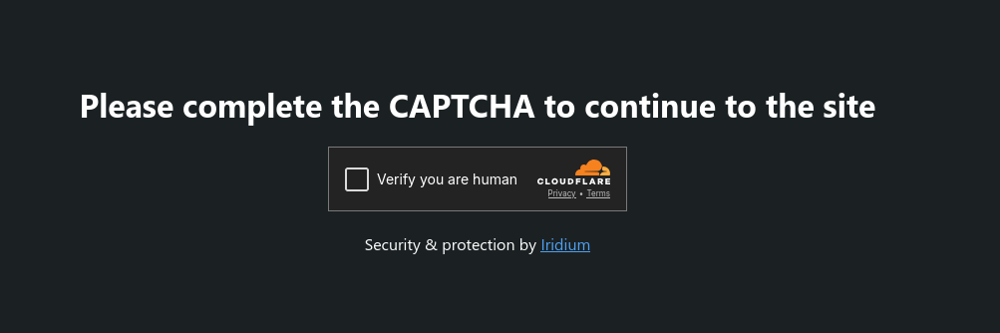

import { Code } from '@astrojs/starlight/components';

export const config = `waf:
  captcha:
    enabled: true
    provider: hcaptcha # or "recaptcha" or "turnstile"
    site_key: your-site-key
    secret_key: your-secret-key
`;

**You can configure Iridium to serve a captcha page instead of a `403 Forbidden` response when a request is blocked.**
To do this, set the `waf.captcha.enabled` option to `true` in the configuration file.

## Supported Providers

Iridium supports the following captcha providers:
- [hCaptcha](https://www.hcaptcha.com/)
- [reCAPTCHA v2](https://developers.google.com/recaptcha/docs/display)
- [Cloudflare Turnstile](https://developers.cloudflare.com/turnstile/)

To change the captcha provider, you can set the `waf.captcha.provider` option to `hcaptcha`, `recaptcha`, or `turnstile`.
You will also need to provide the site key and secret key for the captcha provider you choose. These can be set in the `waf.captcha.site_key` and `waf.captcha.secret_key` options, respectively.

<Code code={config} lang="yaml" title="config.yaml" />

That's all you need to do to enable captcha protection for blocked requests, Iridium will handle the rest!

When the captcha is successfully solved, the user will be allowed to access the requested resource, and a `iridium_clearance` cookie will be set to remember the user for future requests (for 30 minutes by default).

## Spoofing & Tampering Protection

To protect from spoofing, the `iridium_clearance` cookie is tied to the user's IP address and `User-Agent`. If either of these change, the user will need to solve the captcha again.

Also, the cookie is signed using AES-256 encryption to prevent tampering.
